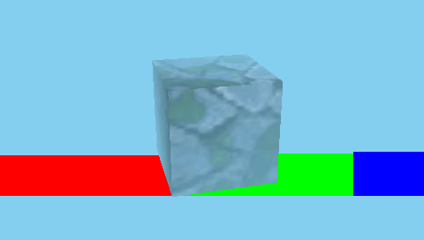
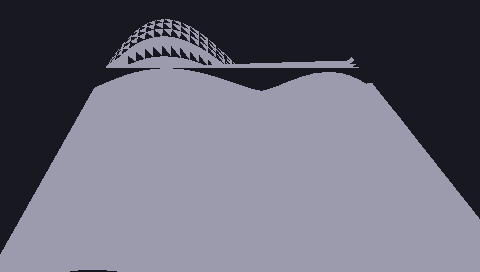
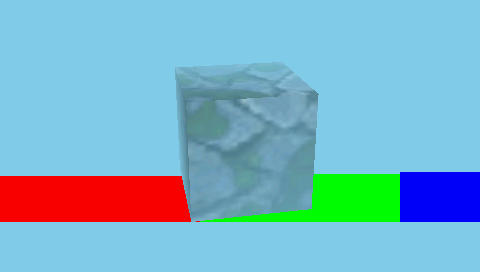
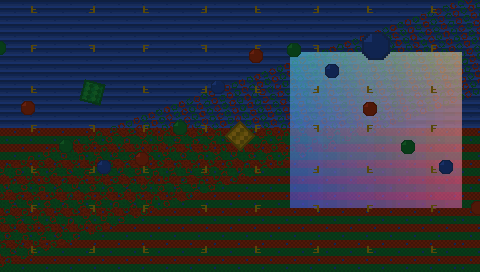

# SS Handheld Console

An open-source handheld game console built around an FPGA graphics engine. It runs
DS-era style 2D and 3D games at a steady 60 fps.

SS stands for Single Screen: a single-screen take on the dual-screen handheld era.

Most open-source consoles are 2D only, or run 3D in software that can't hold a
frame rate. This one does perspective-correct textured 3D and a GBA-class 2D
tile/sprite engine together on one FPGA, composited to a 480x272 panel
at 60 Hz. The whole bitstream builds with an open toolchain (Yosys, nextpnr,
Project Trellis), so no proprietary EDA is needed.

<p align="center">
  
  
</p>
<p align="center">
  
  
</p>

> These frames come straight out of the Verilog RTL in simulation. There are more
> in [sim/proof-of-concept/](sim/proof-of-concept/).

## What it is

Two chips split the work.

The Lattice ECP5 (LFE5U-85F) runs the graphics engine: a 2D tile and sprite PPU
(text and affine backgrounds, sprites, a scanline compositor), a perspective-correct
textured 3D rasterizer, a 32-bit SDRAM subsystem, and RGB panel scanout. All of it
is custom Verilog.

The STM32H723 runs game logic, audio, input, and 3D geometry, streaming
screen-space work to the FPGA over a parallel bus.

The 3D core is built on [RasterIX](https://github.com/ToNi3141/RasterIX) (see
[Credits](#credits)) and extended into a gaming-oriented hybrid GPU that sits next
to the 2D engine and compositor.

## Where it stands

Everything below is validated in simulation and synthesis.

- It fits the LFE5U-85F (caBGA-381) with room to spare: about 34% logic, 72% block
  RAM, 80% DSP.
- Both clock domains meet timing. The GPU domain runs at 73.5 MHz against a 66.67
  target, and the SDRAM domain at 174 MHz against a 133 target. The build is pinned
  to a deterministic place-and-route seed.
- The full pipeline is pixel-exact in simulation. The frames above are direct
  Verilator renders, including a 2048-triangle stress scene at roughly 100 fps.

## Repository layout

| Path | Contents |
|------|----------|
| [rtl/](rtl/) | All the Verilog: 2D PPU, 3D integration, SDRAM controller and clock crossing, FMC bridge, scanout, clocking, board top. |
| [hardware/](hardware/) | KiCad project for the 6-layer board: ECP5, STM32H723, SDRAM, panel, power, audio, controls. |
| [build/](build/) | Bitstream build notes and the reproduce recipe. |
| [sim/](sim/) | Verilator testbenches for every RTL block plus a headless 3D harness. Rendered frames are in sim/proof-of-concept/. |

## Building the bitstream

No vendor tools:

```sh
yosys <synth script>            # produces gpuchip_ecp5.json
nextpnr-ecp5 --85k --package CABGA381 --speed 8 \
  --json gpuchip_ecp5.json --lpf rtl/gpu_chip.lpf --seed 4 \
  --textcfg gpuchip.config
ecppack gpuchip.config gpuchip.bit
```

The RTL depends on the RasterIX 3D core, included here as a submodule. Clone with
submodules so it comes along:

```sh
git clone --recursive <repo-url>
# or, in an existing clone:
git submodule update --init --recursive
```

The full recipe and flashing steps are in [build/README.md](build/README.md).

## Hardware

A 6-layer board in KiCad: the ECP5-85 FPGA and STM32H723 MCU, 32-bit SDRAM, a 4.3
inch 480x272 RGB panel with a boost-driven backlight, microSD, USB-C charging,
stereo audio, and tactile controls. Schematics, layout, and 3D renders are under
[hardware/](hardware/).

## Status

This is a bring-up prototype (v0.1). The design is validated in simulation and
synthesis. First hardware bring-up and a likely v0.2 respin are the next steps.

## Credits

The 3D rasterizer is built on [RasterIX](https://github.com/ToNi3141/RasterIX) by
ToNi3141, an open-source fixed-function OpenGL-ES rasterizer (GPL-3.0). This
project extends it into a hybrid 2D and 3D console GPU. Big thanks to that work.

## License

The repository is dual-licensed by directory:

- rtl/ is GPL-3.0-or-later. The gateware is a derivative of RasterIX (GPL-3.0), so
  it carries the same copyleft terms.
- hardware/ is CERN-OHL-P-2.0, a permissive open-hardware license. The board is an
  independent work.

See [LICENSING.md](LICENSING.md) for the breakdown and the per-file SPDX tags.