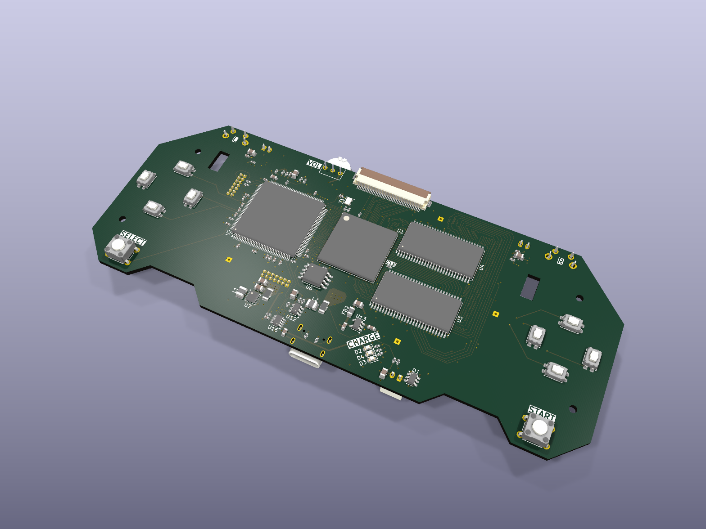
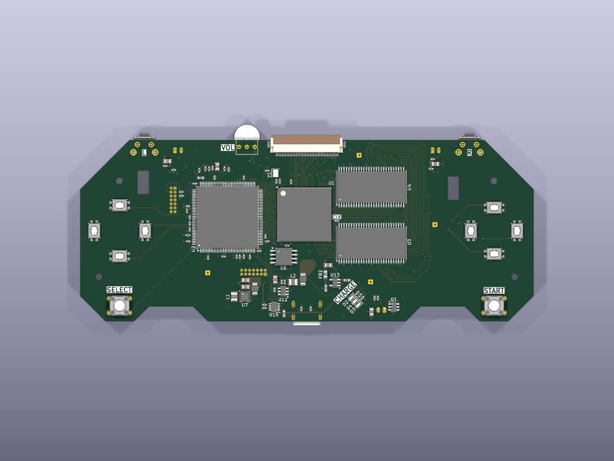
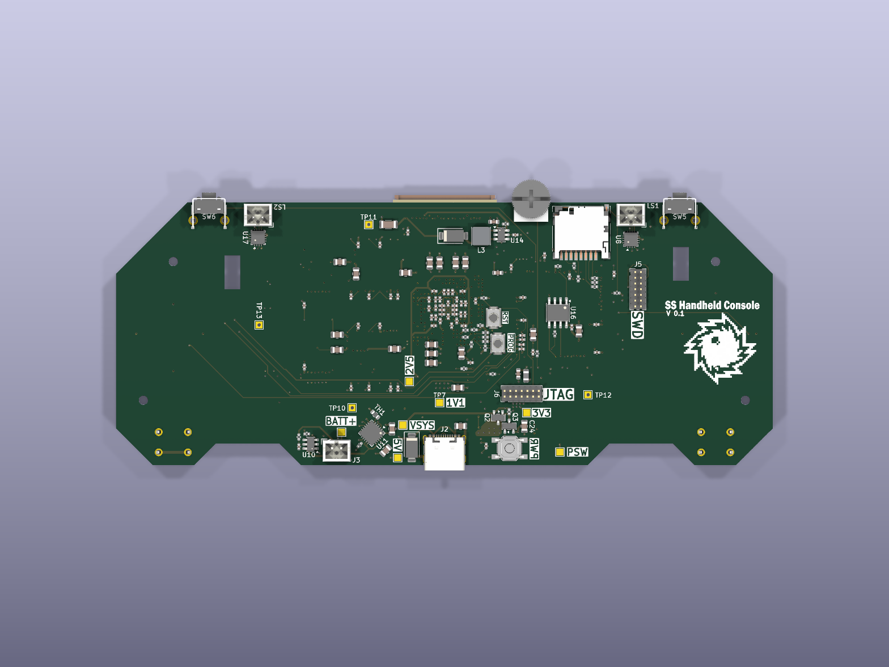

# Hardware

The KiCad project for the SS Handheld Console board. It's a 6-layer PCB that
carries the FPGA, the MCU, memory, the display interface, power, audio amps, and
controls (basically everything).

## Renders

  

  
  

KiCad 3D renders of the current board (top, angled, and bottom).

## Main parts

- FPGA: Lattice ECP5 LFE5U-85F-8, caBGA-381, 0.8 mm pitch. Runs the main graphics engine.
- MCU: STM32H723, LQFP144. Game logic, audio, input, and some 3D geometry.
- Graphics memory: two 16-bit SDR SDRAM chips in parallel, for a 32-bit bus.
- Display: 4.3 inch 480x272 RGB (DPI) panel, with a boost-driven LED backlight.
- Storage: microSD, plus an SPI NOR flash that holds the FPGA configuration.
- MCU work RAM: QSPI PSRAM.
- Power: a single-cell 2500 mAh LiPo feeding a buck-boost 3.3 V rail, a 1.1 V core buck, a
  2.5 V aux LDO, and USB-C charging.
- Audio: stereo I2S class-D amplifiers.
- Controls: tactile D-pad, face, shoulder, and system buttons.

## Board

6-layer stackup: signal, ground, signal, ground, power, signal. The inner signal
layer sits between the two ground planes and mainly carries the SDRAM and FMC buses. The board uses
an ENIG finish for the fine-pitch BGA.

## Files

`Comp Board/` is the KiCad project: schematics, PCB, and the footprint and
3D-model libraries. Open `Comp Board/Comp Board.kicad_pro` in KiCad.

Exported for quick viewing without KiCad:

- [schematics.pdf](schematics.pdf) - all sheets.
- [board_layout.pdf](board_layout.pdf) - all six copper layers, one per page.
- [BOM.csv](BOM.csv) - grouped bill of materials (76 line items).

## License

The hardware is licensed under CERN-OHL-P-2.0 (see the LICENSE file in this
directory). The RTL under `rtl/` is licensed separately, under GPL-3.0-or-later.